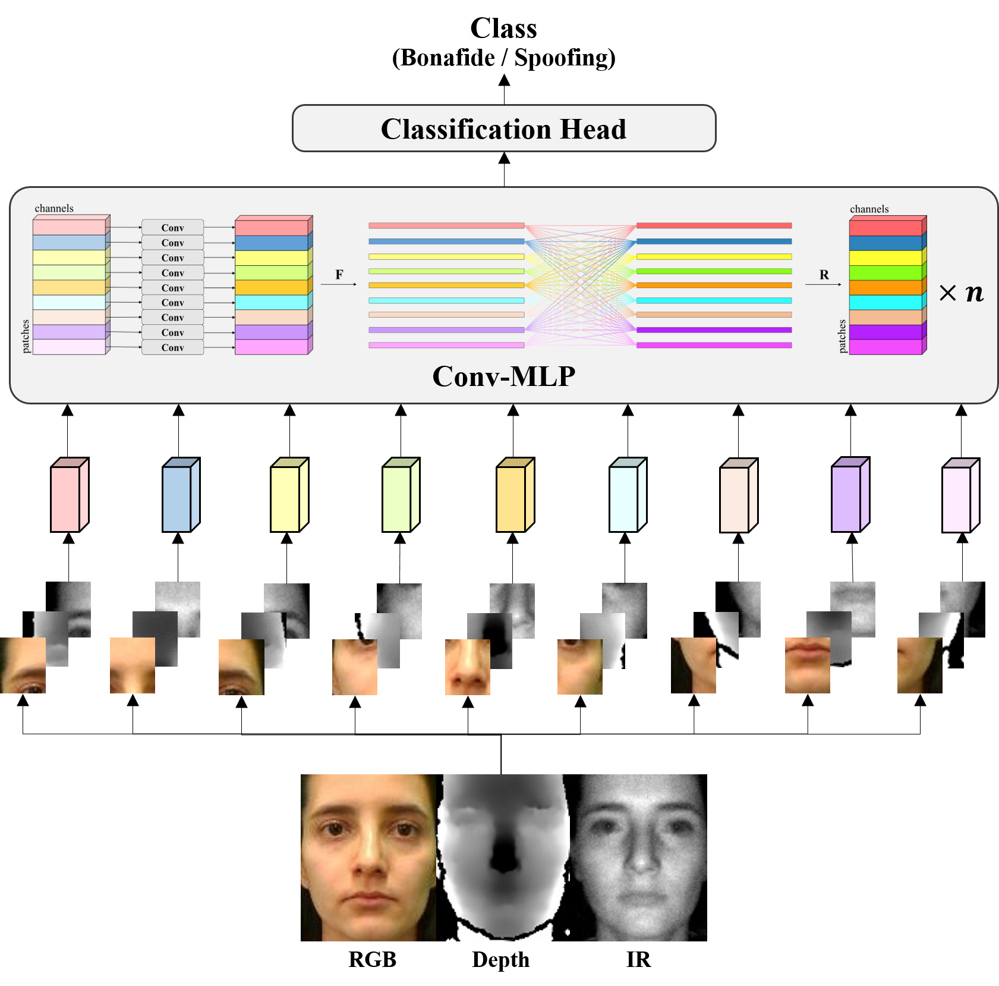
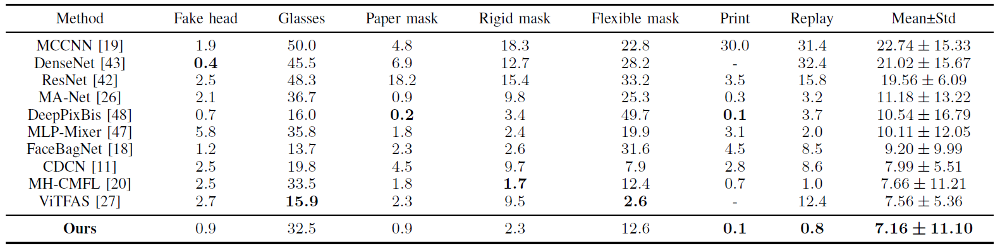
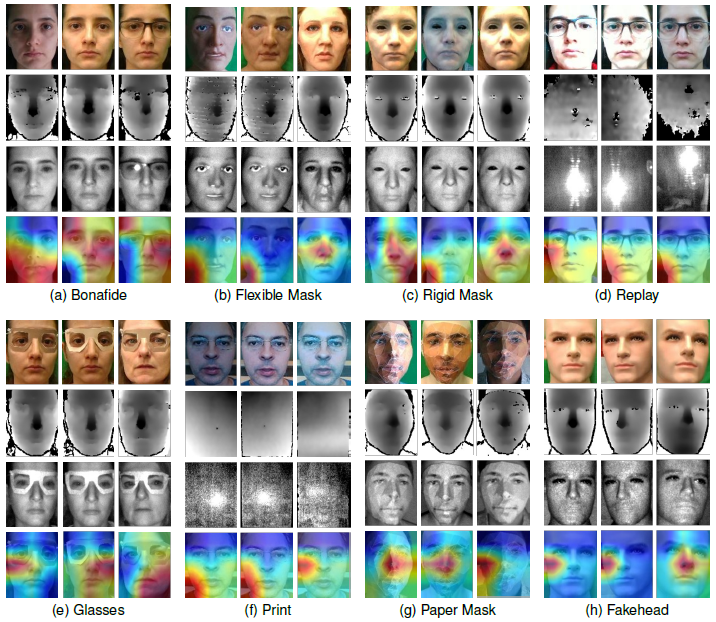

# Conv-MLP：A Convolution and MLP Mixed Model for Multi-Modal Face Anti-Spoofing


## Introduction

This repo is a python reimplementation of Conv-MLP.

Conv-MLP is a simple yet effective  architecture for multi-modal face anti-spoofing, which incorporates local patch convolution with global MLP. 

Conv-MLP breaks the inductive bias limitation of traditional full CNNs and can be expected to better exploit long-range dependencies.



The overall pipeline of Conv-MLP.


## Performace

We conduct experiments to evaluate the performance of
Conv-MLP in terms of accuracy and computational efficiency
on multi-modal benchmarks (WMCA and CeFA) in comparison with existing state-of-the-art methods, including full CNN models and transformer-based ViT models.

### Results on WMCA



As shown, Conv-MLP ranks first in terms of the mean ACER on the seven unseen protocols (7.16 $\pm$ 11.10%), which implies Conv-MLP can extract discriminative representations and performs well on unseen scenarios.



The visualized gradient map of typical samples from WMCA dataset.


## Get Started

### Package Requirement

- Python 3.7
- torch 1.6.0
- opencv-python, numpy, shutil, torchvision, tqdm

### Datasets

We train and test on the [WMCA](https://www.idiap.ch/dataset/wmca) and [CeFA](https://sites.google.com/qq.com/face-anti-spoofing/dataset-download/casia-surf-cefacvpr2020) datasets respectively. According to the usage license agreement, we do not have the right to provide the datasets in public. If you need to use them, please refer to the link and apply to the relevant scientific institutions for research usage.

### Training

- Starting from scratch
```
python train.py
```
- Pretraining
```
python train.py --pretrained_model='model_name.pth'
```
Note that for every training, you need to goto `./data/prepare_data.py` and modify the corresponding data path.

You can also find variables, such as *batch_size*, *patch_size*, *learning rate*, and *number of epoches* in the `train.py`.

### Evaluation

```
python train.py --mode='infer_val' --pretrained_model='model_name.pth'
```
Note that for every testing, you also need to goto `./data/prepare_data.py` and modify the corresponding data path.

## Pretrained Models

We provide pre-trained models on two datasets separately.

- WMCA

    *BaiduCloud:*

    *GoogleDrive:*
- CeFA

    *BaiduCloud:*

    *GoogleDrive:*

